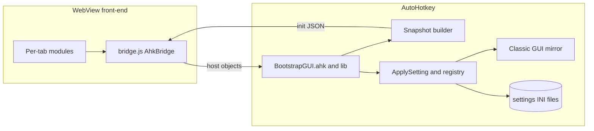

# BootstrapGUI — the Modern UI

The WebView2-based GUI. **AutoHotkey owns every value**: it persists to the INI
files, mirrors the classic GUI, and pushes a full snapshot to the page. The web page
is a view that sends changes back. Everything here is self-contained.

> Deeper project memory (line-number map, hooks in the main script, validation
> notes) lives in [`../CONTEXT.md`](../CONTEXT.md).

## Contents

- [Architecture](#architecture)
- [File map](#file-map)
- [The bridge protocol](#the-bridge-protocol)
- [Load order](#load-order)
- [Module contract](#module-contract)
- [Cache busting](#cache-busting)
- [Adding a new setting](#adding-a-new-setting-end-to-end)
- [Adding or changing a bridge message](#adding-or-changing-a-bridge-message)
- [Validating changes](#validating-changes)

## Architecture



Two channels carry everything between the page and the script:

- **JS → AHK** — named *host objects* on `window.chrome.webview.hostObjects`.
- **AHK → JS** — the `message` event on `window.chrome.webview`.

## File map

| File / dir | Responsibility |
|------------|----------------|
| [`BootstrapGUI.ahk`](BootstrapGUI.ahk) | Entry point, `#Include`s, and the AHK half of the bridge (`WebUpdateState`, `SendBootstrapState`, `nm_WebSnapshot`, `nm_WebApplySetting`, …) |
| [`lib/`](lib) | Shared AHK modules `#Include`d by the entry point ([`Bridge.ahk`](lib/Bridge.ahk): the protocol constant + version check) |
| [`index.html`](index.html) | The entire single-page front-end |
| [`assets/js/2/bridge.js`](assets/js/2/bridge.js) | Shared transport (`window.AhkBridge`) |
| [`assets/js/2/patternInterpreter.js`](assets/js/2/patternInterpreter.js) | Pattern `.ahk` → SVG trace renderer |
| [`assets/js/2/*TabHandlers.js`](assets/js/2) | One module per tab; declare controls, send changes, apply from AHK |
| [`assets/css/styles.css`](assets/css/styles.css) | Project CSS, loaded **last** |
| [`WebViewToo_Resources/`](WebViewToo_Resources) | Vendored WebViewToo library — **do not edit** |

## The bridge protocol

The page and the script exchange JSON. Treat this as a versioned API.

### Envelope

Every message **should** carry a protocol version:

```json
{ "v": 1, "type": "<type>", "key": "<optional>", "value": "<optional>" }
```

`v` is emitted automatically by [`window.AhkBridge`](assets/js/2/bridge.js)
(`PROTOCOL_VERSION`). AHK mirrors it in `nm_BridgeProtocolVersion`
([`lib/Bridge.ahk`](lib/Bridge.ahk)) and only **logs** when a page speaks a newer
version — it never rejects the message — so old and new pages keep working during a
rollout. Senders that omit `v` are still accepted.

### Host objects (JS → AHK)

Registered in [`BootstrapGUI.ahk`](BootstrapGUI.ahk) with
`MyWindow.AddHostObjectToScript(name, { func: <AHK function> })`. Call them through
the `AhkBridge` helpers, never `window.chrome.webview` directly.

| Host object | AHK handler | Purpose |
|-------------|-------------|---------|
| `ahkUpdateState` | `WebUpdateStateSafe` | All setting/state messages (the main channel) |
| `ahkButtonClick` | `WebButtonClickEvent` | Top-bar + tab action buttons |
| `ahkGatherAction` | `WebGatherActionEvent` | Gather tab Save/Copy/Paste defaults |
| `ahkFormSubmit` | `FormSubmitEvent` | Form submissions |
| `ahkCopyGlyphCode` | `CopyGlyphCodeEvent` | Copy a glyph code to the clipboard |

### Message types (JS → AHK)

Routed by the `switch data["type"]` in `WebUpdateState`.

| `type` | Payload | Meaning |
|--------|---------|---------|
| `gatherFields` | `fields: [...]` | The full list of fields to gather (add/remove/rename) |
| `gatherField` | `num, key, value` | One per-field gather setting (`FieldPattern2`, …) |
| `collect` | `key, value` | Collect tab setting |
| `kill` | `key, value` | Kill tab setting |
| `killSettings` | `…` | Legacy kill-settings push |
| `boost` | `key, value` | Boost tab setting |
| `plants` | `key, value` | Planters tab setting |
| `quests` | `key, value` | Quest tab setting |
| `gather` | `key, value` | Gather tab global setting |
| `status` | `key, value` | Status tab setting |
| `settings` | `key, value` | Settings tab setting |
| `misc` | `key, value` | Misc tab setting |
| `guiMode` | `value: "new" \| "classic"` | Header Classic/Modern switch |
| `tab` | `key: "Tab", value: <webid>` | Sidebar tab changed |
| `patternRequest` | `key: <name>` | Request a pattern file's source text |
| `patternListRequest` | — | Request the list of available patterns |

### Message types (AHK → JS)

Sent with `MyWindow.PostWebMessageAsString(...)`.

| `type` | Payload | Meaning |
|--------|---------|---------|
| `init` | one key per tab + `version`, `natroVersion`, `guiMode`, `patternList` | Full snapshot; every tab restores from this |
| `settings` / `status` / `plants` / `quests` / `collect` / `boost` / `kill` / `gather` / `misc` | `key, value` | Live single-setting echo from a classic-side change |
| `guiMode` | `value` | Push the current GUI mode to the header switch |
| `tab` | `value` | Push the current classic tab to the web sidebar |
| `patternText` | `key, text` | Pattern source text reply |
| `patternList` | list | Pattern names reply |

### The `init` payload

`SendBootstrapState` / `nm_WebSnapshot` build it; each tab reads its own slice and
ignores the rest:

```json
{
  "type": "init",
  "version": "<app timestamp>",
  "natroVersion": "<macro version id>",
  "guiMode": "new",
  "patternList": ["Auryn", "Snake", "..."],
  "gather":         [ {field1}, {field2}, {field3} ],
  "collect":        { ... },
  "kill":           { ... },
  "boost":          { ... },
  "plants":         { ... },
  "quests":         { ... },
  "settings":       { ... },
  "status":         { ... },
  "misc":           { ... },
  "blender":        { ... },
  "shrine":         { ... },
  "gatherSettings": { ... },
  "collectExtras":  { ... }
}
```

## Load order

**AHK.** [`BootstrapGUI.ahk`](BootstrapGUI.ahk) is included by
[`../submacros/natro_macro.ahk`](../submacros/natro_macro.ahk) **after** the
WebViewToo includes, so the `WebViewGui` / `WebViewCtrl` classes already exist.
Inside it, the `lib/*.ahk` files are included in dependency order (data/helpers
first, entry points last). Keep that ordering when adding files.

**Front-end.** Order matters because modules publish globals that later scripts use.
From [`index.html`](index.html) (bottom of the document):

1. Vendored libraries: jQuery, jQuery UI, Popper, Bootstrap, ms-dropdown,
   bootstrap-select.
2. [`bs-init.js`](assets/js/bs-init.js) — header/rail layout sync.
3. [`patternInterpreter.js`](assets/js/2/patternInterpreter.js)
4. [`bridge.js`](assets/js/2/bridge.js) — **must load before the tab modules.**
5. [`dynamicTabs.js`](assets/js/2/dynamicTabs.js)
6. `*TabHandlers.js` — kill, boost, collect, planters, quests, gather, status,
   settings, misc.

## Module contract

Each tab module is an IIFE (or documented globals) that:

- holds a control map (`KEY -> { sel, kind }`),
- exposes `initialize()`, `applyFromAhk(key, value)`, `restoreState(payload)`, and
  `send(key, value)` on a `window.<name>TabHandlers` object,
- wires its listener with
  `AhkBridge.registerTab(<type>, <initKey>, { applyFromAhk, restoreState })`.

## Cache busting

The page is served from the `ahk.localhost` virtual host and cached. On each launch
[`BootstrapGUI.ahk`](BootstrapGUI.ahk) navigates to
`BootstrapGUI/index.html?v=<A_TickCount>` so `index.html` is always fresh, but scripts
carry their own `?v=` tokens. **Bump a script's `?v=` in [`index.html`](index.html)
whenever you edit that script.**

## Adding a new setting (end to end)

A setting is described in up to four places. Add it in all of them:

1. **Front-end control map** — add an entry to the relevant `*_CONTROLS` object
   (e.g. `SETTINGS_CONTROLS` in
   [`settingsTabHandlers.js`](assets/js/2/settingsTabHandlers.js)).
2. **AHK apply** — handle the key in the bridge
   ([`WebUpdateState()`](BootstrapGUI.ahk) or [`nm_WebApplySetting()`](BootstrapGUI.ahk)).
3. **AHK snapshot** — include the key in [`nm_WebSnapshot()`](BootstrapGUI.ahk) so
   first paint and classic→web polling see it.
4. **Classic mirror** — if the classic GUI has a matching control, mirror it.

> **Collect-style keys are registry-driven.** A simple boolean/text key whose global,
> INI key and classic control all share one name is declared once in the
> `collectRegistry` inside [`WebUpdateState()`](BootstrapGUI.ahk) rather than adding
> another `else if`. The Gather per-field keys use the same idea through the `gmap`
> map. Keep the registry `if` at the head of the same `if/else if` chain so the
> remaining `else` branches still attach.

## Adding or changing a bridge message

1. Pick a stable `type` string and add it to the tables above.
2. On the JS side, send with `AhkBridge` and receive with `AhkBridge.registerTab`.
3. On the AHK side, add a `case` to `WebUpdateState` (or a registry entry) and, if
   the value is persisted, include it in `nm_WebSnapshot`.
4. Bump `PROTOCOL_VERSION` in [`bridge.js`](assets/js/2/bridge.js) **only** if the
   change is breaking for an already-shipped page.

## Validating changes

There is no automated test harness. Before committing:

- Syntax-check the script with the bundled 64-bit interpreter:
  `submacros\AutoHotkey64.exe /validate submacros\natro_macro.ahk`.
- Run the app with [`../START.bat`](../START.bat) and smoke test: flip
  **Classic ↔ Modern**, and for each tab you touched edit a control in the web UI and
  confirm the classic GUI and `settings/nm_config.ini` update, then edit it in the
  classic GUI and confirm the web UI updates.
